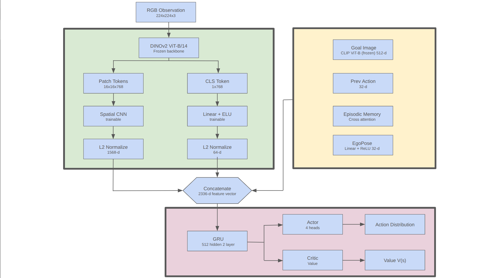
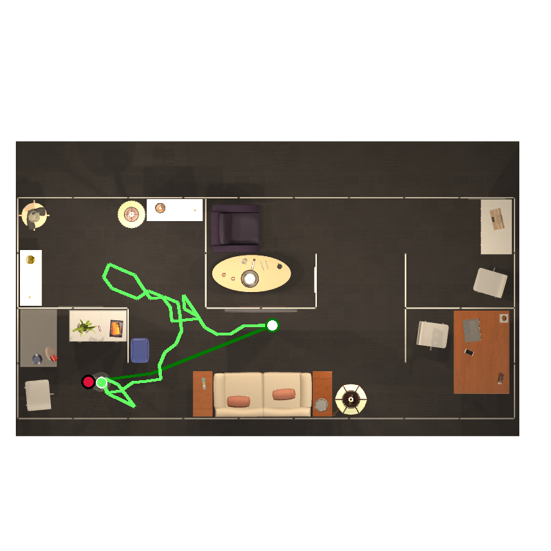
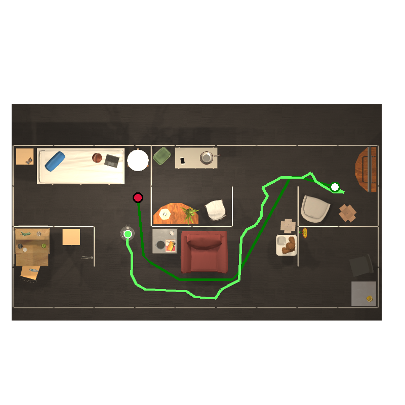
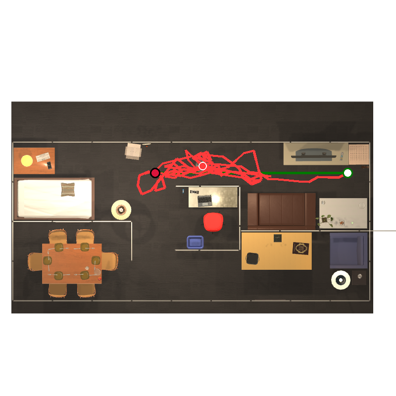
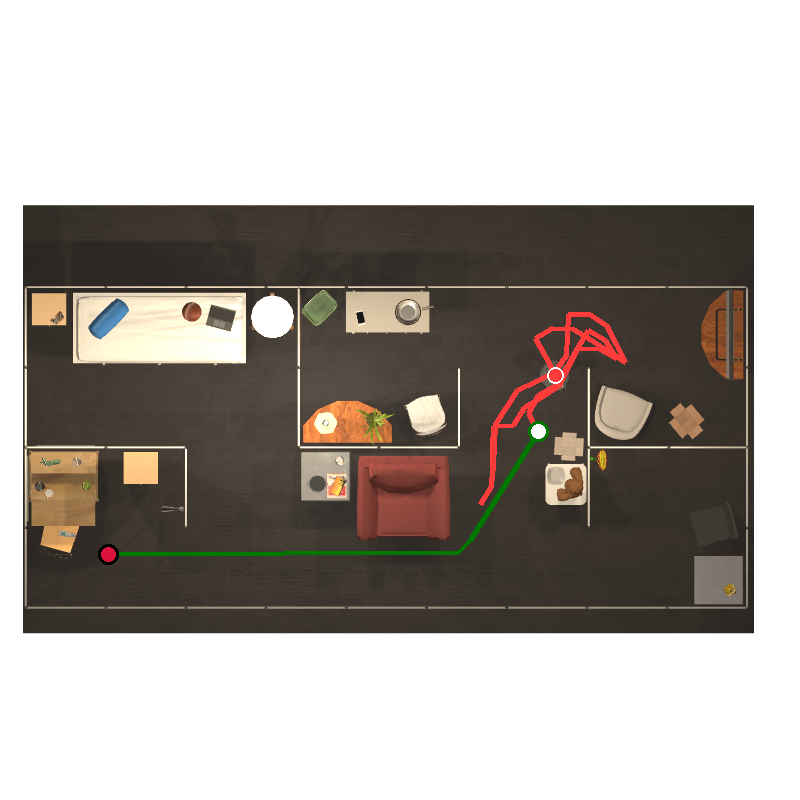
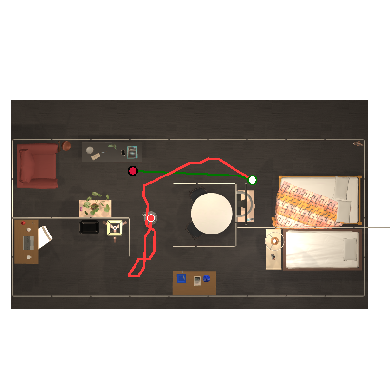
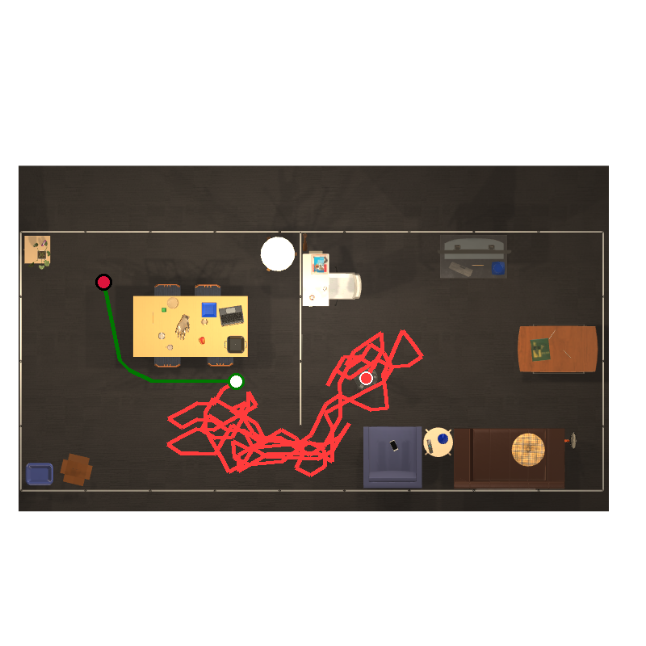
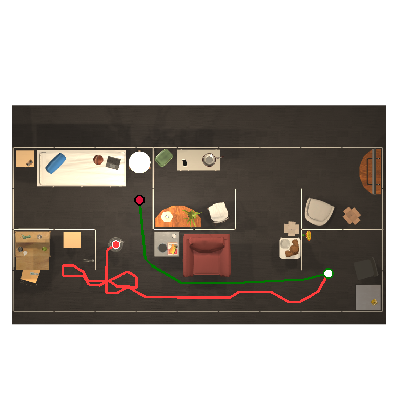
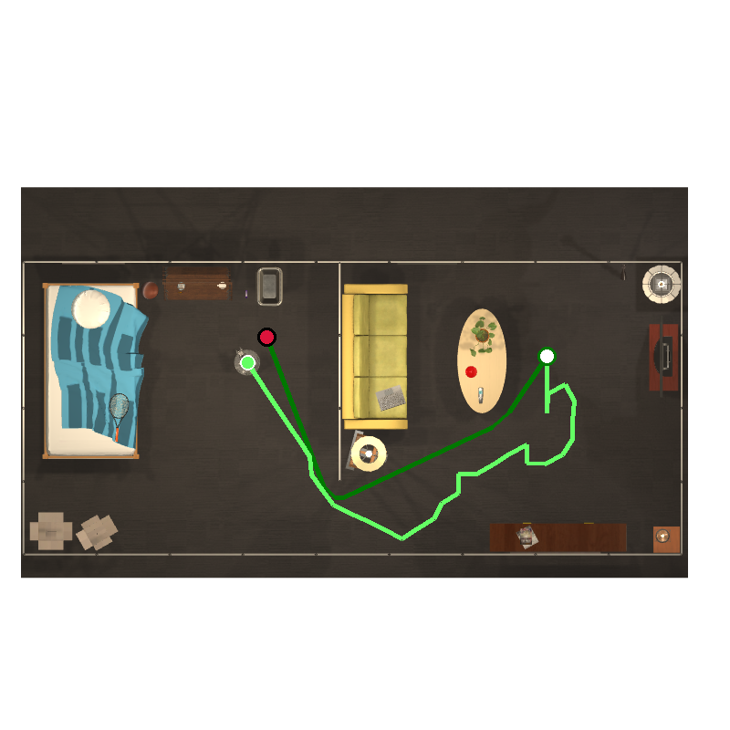

# See2Seek

Zero-shot embodied navigation in **RoboTHOR** using frozen **DINOv2 + CLIP**
encoders with a recurrent **PPO** policy and episodic spatial memory. Trained
on ImageNav (image goals); transfers zero-shot to ObjectNav (CLIP text-encoded
object goals) with no additional training.

**Why "See2Seek"?** The agent *sees* a goal — an image in ImageNav, a text
label in ObjectNav — and then *seeks* it out in the environment. The same
frozen CLIP embedding space covers both goal modalities.

[](https://github.com/utsab345/see2seek/actions)
[]()
[](LICENSE)



*Figure 1 — end-to-end architecture: frozen DINOv2/CLIP encoders, trainable
spatial CNN and projection heads, pose-conditioned episodic memory, and the
2-layer GRU policy that fuses them into a multimodal state.*

---

## Highlights

- **Frozen, pluggable encoders** — DINOv2 ViT-B/14 for scene observations,
  CLIP ViT-B/32 for image *and* text goals (the text path is what enables
  zero-shot ObjectNav).
- **Recurrent Actor-Critic** — 2-layer GRU (512 hidden); layer 1 fuses
  multimodal perception, layer 2 handles temporal reasoning.
- **Episodic spatial memory** — 128-slot rolling buffer of CLS tokens with
  pose-conditioned cross-attention; no BPTT through time.
- **Collision-aware ego-pose** — dead-reckoned `[x, y, cosθ, sinθ]`, updated
  only on successful moves; combined with memory it enables loop detection and
  room escape.
- **Recurrent-PPO training** — fp16/CPU-offloaded rollout storage, chunked
  mini-batches, max-steps curriculum, exploration-bonus decay, resumable
  checkpoints, W&B logging.
- **Ablations first-class** — direct ego-pose and episodic memory are optional;
  disabled branches are stripped from the architecture and GRU input, and every
  variant is resumable and reproducible.

> **First, an honest caveat.** The numbers below are single-run point
> estimates. Repeated-seed standard deviations, hardware, wall-clock time, and
> baseline comparisons are not measured yet — treat the small ImageNav vs.
> ObjectNav gap (≈ 1.6 pp overall SR) as indicative rather than conclusive.
> See [Future work](#future-work).

## Results

Trained for 10M steps. Difficulty is the oracle shortest-path distance:
easy ≤ 3 m, medium 3–6 m, hard > 6 m.

| Task | Overall SR | Overall SPL | Easy SR | Medium SR | Hard SR |
|------|-----------:|------------:|--------:|----------:|--------:|
| ImageNav | 15.4% | 0.094 | 23.1% | 8.7% | 5.7% |
| ObjectNav (zero-shot) | 17.0% | 0.108 | 27.4% | 8.2% | 5.1% |

ObjectNav's higher overall SR is driven almost entirely by easy episodes
(27.4% vs 23.1%). On medium and hard episodes it trails ImageNav
(8.2% / 5.1% vs 8.7% / 5.7%), i.e. the CLIP text→vision alignment helps at
close range but does not produce sustained goal-directed long-horizon
navigation.

**ObjectNav prompt format.** Object goals are fixed, templated English class
phrases resolved per target *category* (e.g. `"a laptop"`), shared by every
instance of that category — not per-instance descriptions
(`evaluation/evaluator.py`, `_get_category_map`).

### Experimental setup

- **Seed** — single default `Config.seed = 42`; each simulator worker derives
  its RNG as `seed + worker_id`.
- **Training** — 10M environment steps; max-steps curriculum 150 → 500 over
  the first 3M steps (see [Configuration](#configuration)).
- **Evaluation** — each validation episode is visited once per task; metrics
  are point estimates without confidence intervals.
- **Difficulty buckets** — oracle shortest-path ≤ 3 m (easy), 3–6 m (medium),
  > 6 m (hard).

## Contributions

**Reproduced / reused.** Frozen CLIP and DINOv2 encoders (unmodified); PPO
(Schulman et al., 2017) with standard hyperparameters; RoboTHOR ImageNav and
ObjectNav episode definitions as in ZSON (Majumdar et al., 2022).

**New in this project.**

- **A frozen-encoder recurrent policy for ImageNav** — only the spatial CNN,
  projection heads, episodic memory, and 2-layer GRU are trained.
- **Zero-shot image→text goal transfer in RoboTHOR** — a single policy
  navigates to CLIP text-embedded object categories with no ObjectNav training.
- **Pose-conditioned episodic memory without backprop-through-time** — a
  128-slot rolling buffer of detached CLS tokens read out by cross-attention;
  memory trains online, with no truncated BPTT.
- **Controlled ablations of ego-pose and memory** — disabled branches are
  stripped from the model and the GRU input dimension (not merely zero-masked),
  see [the ablation reference](#ablation-reference-gru-input).
- **An end-to-end reproducible framework** — typed configs, dataset tooling,
  train/eval scripts, and CI-gated tests that run without a GPU or simulator.

These components are deliberately independent so each one's causal contribution
can be isolated (see [Future work](#future-work)).

## Contents

- [Contributions](#contributions)
- [Installation](#installation)
- [Quickstart](#quickstart)
- [Architecture](#architecture)
- [Project structure](#project-structure)
- [Configuration](#configuration)
- [Reward function](#reward-function)
- [Metrics](#metrics)
- [Dataset](#dataset)
- [Reproducibility](#reproducibility)
- [Development](#development)
- [Trajectory examples](#trajectory-examples)
- [Limitations](#limitations)
- [Future work](#future-work)
- [References](#references)

## Installation

```bash
python -m venv .venv && source .venv/bin/activate
pip install -e ".[dev]"
pre-commit install
```

The [RoboTHOR](https://arxiv.org/abs/2004.06799) simulator (`ai2thor`) is
required at train/eval time but is **not** needed for the unit test suite.

## Quickstart

```bash
# Train (DINOv2 obs encoder, 16 parallel RoboTHOR workers)
python scripts/train.py

# Debug mode (2 envs, 2 updates, no W&B)
python scripts/train.py --debug

# Resume from checkpoint
python scripts/train.py --resume data_dino_v7/checkpoints/checkpoint_000010000000.pth

# Evaluate ImageNav
python scripts/eval.py --checkpoint data_dino_v7/checkpoints/checkpoint_final.pth --task imagenav

# Zero-shot ObjectNav (CLIP text goal; dead-reckoned ego-pose is still used)
python scripts/eval.py --checkpoint data_dino_v7/checkpoints/checkpoint_final.pth --task objectnav

# Bird's-eye trajectory visualization
python scripts/visualize_trajectory.py \
    --checkpoint data_dino_v7/checkpoints/checkpoint_final.pth \
    --episodes FloorPlan_Val3_2_Apple_6 \
    --episodes_path /path/to/val/episodes \
    --scene_dataset_path /path/to/val

# Plot training curves / evaluation results
python scripts/plot_training.py
python scripts/plot_evaluation.py
```

### Ego-pose and episodic-memory ablations

```bash
python scripts/train.py --no-egopose              # drop direct ego-pose input
python scripts/train.py --no-episodic-memory      # drop memory + its GRU input
python scripts/train.py --no-egopose --no-episodic-memory
```

Each ablation is a fresh run with a distinct architecture (parameter shapes
change). See [Ablation reference](#ablation-reference-gru-input).

## Architecture

See Figure 1 above for the full data flow. Branch table:

| Branch | Source | Output dim | Trainable |
|--------|--------|-----------:|:---------:|
| Spatial | DINOv2 patch tokens (256×768) → 2-layer CNN | 1568 | ✅ |
| CLS | DINOv2 CLS token → Linear/LN/ELU | 64 | ✅ |
| Goal | CLIP ViT-B/32 embedding → Linear/LN/ELU | 512 | ❌ (frozen) |
| Episodic memory | Cross-attention over last 128 CLS tokens + poses | 128 | ✅ |
| Prev action | Learned embedding | 32 | ✅ |
| Ego-pose | Dead-reckoned [x, y, cosθ, sinθ] → Linear+ReLU | 32 | ✅ |
| **GRU input** | | **2336** | |

**Recurrent core:** 2-layer GRU, 512 hidden. Layer 1 fuses multimodal
perception; layer 2 handles temporal reasoning and planning. All frozen
encoders (DINOv2, CLIP) — only the spatial CNN, projections, memory module,
and GRU are trainable.

**Episodic memory** stores the last 128 CLS tokens in a rolling buffer with
pose-conditioned cross-attention readout. Stored tokens are detached (no BPTT
through time), resets at episode boundaries, and gives the agent a
"have I been here before?" signal. This is a coarse, queryable *place* memory,
**not** a metric/occupancy map: the policy never plans shortest paths over it,
and the buffer only shapes revisiting behaviour through attention.

**Ego-pose** is a local, dead-reckoned odometry signal (there is **no GPS/global
positioning**): `[x, y, cosθ, sinθ]` is integrated from discrete actions and
updated only on successful moves, so it is immune to wall failures but drifts
on long horizons.

### Ablation reference (GRU input)

| DINOv2 variant (PointGoal off) | GRU input dim |
|---|---:|
| Full model | 2336 |
| No direct ego-pose | 2304 |
| No episodic memory | 2208 |
| Neither branch | 2176 |

Disabled branches are removed from the model and GRU input entirely. The
no-memory variant has no attention parameters or memory buffers; the GRU stays
recurrent. `--no-egopose` removes only the direct 32-dim branch, leaving pose
conditioning intact inside memory. Evaluation and trajectory visualization
restore the architecture from the checkpoint automatically — no flags needed.

## Project structure

```
see2seek/
├── scripts/                  # CLI entry points
│   ├── train.py              #   PPO training (config/resume/debug/ablation flags)
│   ├── eval.py               #   ImageNav / ObjectNav evaluation
│   ├── evaluate (eval_difficulty_trajectory.py)
│   ├── visualize_trajectory.py
│   └── plot_training.py, plot_evaluation.py
├── see2seek/                 # installable package
│   ├── agents/               #   GRU Actor-Critic + episodic memory
│   ├── buffers/              #   recurrent-PPO rollout storage
│   ├── envs/                 #   RoboTHOR env + shared-memory VecEnv
│   ├── models/encoders/      #   frozen DINOv2 / CLIP
│   ├── trainers/             #   PPO loop (curriculum, resume, W&B)
│   ├── evaluation/           #   parallel evaluator + SR/SPL metrics
│   └── utils/                #   config, dataset tooling, viz helpers
├── configs/                  # YAML overrides (optional; CLI flags win)
├── docs/                     # architecture diagram, trajectory figures
├── tests/                    # unit tests (no simulator required)
├── .github/workflows/ci.yml  # lint + format + types + tests
├── pyproject.toml            # packaging + ruff/black/mypy/pytest config
└── Makefile                  # dev conveniences (make lint / check / test)
```

## Configuration

Configuration is a dataclass tree in `see2seek/utils/config.py`; YAML files in
`configs/` deep-merge over the defaults, so an override file only needs the
fields you want to change. Unknown keys are ignored.

Key training defaults:

- 16 parallel RoboTHOR workers (shared-memory VecEnv with auto worker respawn)
- 128 steps/env = 2048 samples per PPO update
- PPO: 4 epochs, 2 mini-batches, clip 0.2, entropy 0.05
- Adam lr 2.5e-4 with linear decay
- Curriculum: max_steps 150 → 500 over 3M steps
- Exploration bonus 0.10 per new cell, decaying to a 0.015 floor over 10M steps

Data paths are validated **before** W&B, model loading, or worker startup.
ImageNav requires cached `embeddings.pt` for image goals when episodic memory
is disabled.

## Reward function

| Param | Value | Purpose |
|------|---:|---|
| `success_reward` | +10.0 | Stop within 1 m of goal |
| `angle_success_reward` | +5.0 | Stop within 1 m AND facing goal heading (±25°) |
| `failed_stop_penalty` | −0.5 | Stop far from goal (shaped by distance) |
| `timeout_penalty` | −2.0 | Episode times out without stopping |
| `geodesic_reward_scale` | 1.5 | Reward for reducing shortest-path distance |
| `slack_reward` | −0.005 | Per-step cost |
| `exploration_bonus` | 0.10 | Intrinsic reward for new grid cells, decays to 0.015 over 10M steps |
| `collision_penalty` | −0.01 | Walking into walls |
| `rotation_penalty` | −0.002 | Per-rotation cost to prevent spinning |

Angle-to-goal shaping is active only within 1 m of the goal, encouraging
orientation before `Stop`.

## Metrics

- **SR (Success Rate)** — fraction of episodes where the agent calls `Stop`
  within 1 m of the goal.
- **SPL (Success weighted by Path Length)** (Anderson et al., 2018) — SR
  down-weighted by path efficiency: `SPL = S·L / max(p, L)`.

## Dataset

The dataset is **not bundled** (RoboTHOR scenes and per-scene episode files are
large). Build it in four stages with the tooling under `see2seek/utils/`:

1. **Generate episodes** — `generate_data.py` converts RoboTHOR `*.json.gz`
   episode dumps into per-scene episode JSON for the `debug`, `train`, and
   `val` splits. It takes no CLI args: set `INPUT_DATASET_DIR` and
   `OUTPUT_DATASET_DIR` at the top of the file, then run
   `python -m see2seek.utils.generate_data`.

2. **Filter degenerate episodes** — drop episodes whose oracle shortest path
   is ≤ 1.5 m (≈18% of the original set):
   `python -m see2seek.utils.filter_episodes --dataset_dir dataset/train --dry_run`
   (drop `--dry_run` to apply; backups of edited files are written unless
   `--no_backup`).

3. **Augment goal headings** *(optional)* — `augment_goal_angles.py` renders
   the goal from several headings with parallel AI2-THOR instances and writes
   an augmented `episodes/` plus `embeddings.pt`:
   `python -m see2seek.utils.augment_goal_angles --input_dir ... --output_dir ...`.

4. **Cache CLIP goal embeddings** — `image2vec.py` batch-encodes goal images
   into `embeddings.pt` and resumes from partial runs:
   `python -m see2seek.utils.image2vec --splits train val`.

Expected layout (matches `env.scene_dataset_path` / `env.episodes_path` in
`configs/*.yaml`):

```
dataset/
├── train/
│   ├── episodes/          # per-scene episode JSON files
│   └── embeddings.pt      # cached CLIP goal embeddings (image2vec.py)
└── val/
    ├── episodes/
    └── embeddings.pt
```

Point `validate_dataset_paths` at this layout (`--scene-dataset-path` /
`--episodes-path`) and it will pass before any model or worker is started.

## Reproducibility

- **Known-good configuration** — `configs/train_robothor.yaml` (train) and
  `configs/eval.yaml` (eval) are the reference overrides; the only edits
  needed are the dataset paths they hard-code.
- **CPU-only, no-simulator tests** — `make test` / `pytest` exercises config
  merging, navigation metrics, and difficulty parsing in pure Python — no GPU,
  no `ai2thor`, no downloaded weights.
- **Ablation flags** — `--no-egopose`, `--no-episodic-memory`, and
  `--debug` (2 envs, 2 updates, no W&B) are smoke-test paths that need no
  dataset changes.
- **Encoder weights** — DINOv2 (torch hub) and CLIP (open_clip) are downloaded
  automatically on first use: DINOv2 under `~/.cache/torch/hub/checkpoints/`,
  CLIP under the open_clip/Hugging Face cache (`~/.cache/huggingface/` by
  default). Set `TORCH_HOME` / the cache dir to relocate them.
- **Dependency versions** — the dev toolchain is pinned in `pyproject.toml`
  (`ruff==0.16.7`, `black==26.5.1`, `mypy==1.14.1`); runtime dependencies use
  lower bounds. To pin everything, export `pip freeze > requirements.lock` from
  the exact environment that produced reported results.

## Development

```bash
make lint     # ruff + black --check
make check    # mypy
make test     # pytest
make format   # black + ruff --fix
```

All four gates also run in CI (`.github/workflows/ci.yml`) and as pre-commit
hooks. Tests are pure-Python unit tests (config merging, metrics, difficulty
parsing) and need no simulator or GPU.

Commits follow folder-scoped conventional titles, e.g.
`feat(agents): ...`, `fix(envs): ...`, `docs(trainers): ...`. See
`CONTRIBUTING.md` before submitting changes.

## Trajectory examples

Green paths are successful trials, red failed. Light green is the oracle
shortest path. White/green circle = start, red/black circle = goal, green
circle = successful stop, red circle = failed stop.

| | |
|:---:|:---:|
| <br>Bowl · Val2_4 | <br>Laptop · Val2_2 |
| <br>SprayBottle · Val1_5 | <br>Mug · Val2_2 |
| <br>HousePlant · Val1_1 | <br>BasketBall · Val3_5 |
| <br>Laptop · Val2_2 | <br>Bowl · Val3_4 |

## Limitations

- **Long-horizon performance collapses** — ImageNav success drops from 23.1%
  (easy) to 5.7% (hard); on medium/hard episodes zero-shot ObjectNav trails the
  task it was trained on. Dense-frontier and recursive behaviours are not
  learned reliably past a few metres.
- **Ego-pose drift** — pose is dead-reckoned with no metric re-localisation,
  so heading/position error accumulates on long episodes.
- **No metric map** — episodic memory is not an occupancy map; the policy can
  neither plan shortest paths nor reason over explicit geometry.
- **Simulator dependence** — all results are in RoboTHOR via `ai2thor`;
  sim-to-real transfer is untested.
- **Frozen encoders** — DINOv2/CLIP cannot adapt to the navigation domain, so
  observation/goal adaptation is bounded by what the frozen embeddings already
  encode.
- **Single-seed point estimates** — none of the metrics carry variance or
  baseline error bars yet.

## Future work

- Repeat training across ≥ 3 seeds and report mean ± std.
- Add baselines: random policy, greedy CLIP-similarity, PPO without memory,
  PPO without ego-pose, and trainable-encoder policies.
- Report a full ablation table (full / no ego-pose / no memory / neither).
- Add a lightweight metric-map head (e.g. top-down occupancy) for geo-causal
  planning.
- Evaluate sim-to-real in a photorealistic renderer.

## References

- [ZSON: Zero-Shot Object-Goal Navigation](https://arxiv.org/abs/2206.12403)
- [EmbCLIP: Simple but Effective CLIP Embeddings for Embodied AI](https://arxiv.org/abs/2111.09888)
- [DINOv2: Learning Robust Visual Features](https://arxiv.org/abs/2304.07193)
- [CLIP: Learning Transferable Visual Models From Natural Language Supervision](https://arxiv.org/abs/2103.00020)
- [RoboTHOR: An Open Simulation-to-Real Embodied AI Platform](https://arxiv.org/abs/2004.06799)

## Team

- Abiral Panta
- Dipin Adhikari
- Utsab Dahal

## License

MIT — see [LICENSE](LICENSE).